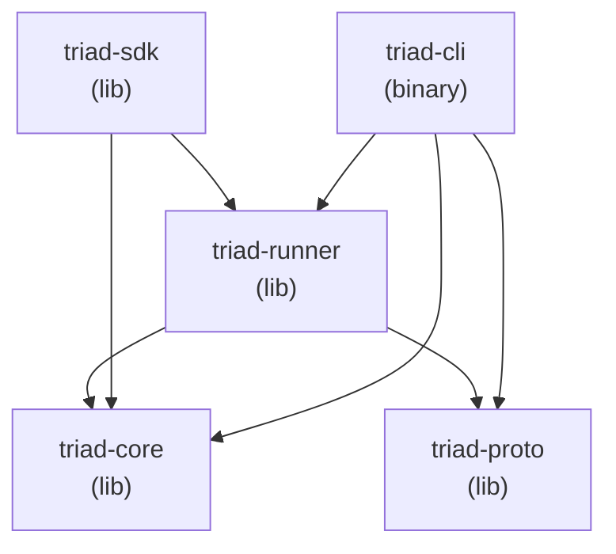

# Triad: Physical Design

Rust implementation of the Triad system design (`triad-system-design.md`). This document covers the Cargo workspace layout, crate responsibilities, module structure, Rust type definitions, database schema, proto definitions, and test organisation. It is the authoritative implementation blueprint — the system design document is the authoritative conceptual reference.

**Crate selection rationale:** see the crate discussion in session notes. Key choices: `tokio` (runtime), `tonic` + `prost` (gRPC), `axum` + `tower` (HTTP), `clap` (CLI), `rdkafka` (Kafka with EOS), `sqlx` + `tokio-postgres` (PostgreSQL + WAL), `redis` + `deadpool-redis` (Redis), `tracing` + `tracing-opentelemetry` (observability), `metrics` + `metrics-exporter-prometheus` (Prometheus), `thiserror` / `anyhow` (errors), `config` (YAML + env), `mockall` + `testcontainers` (testing).

---

## Table of Contents

- [§1 Workspace Layout](#1-workspace-layout)
  - [§1.1 Directory Tree](#11-directory-tree)
  - [§1.2 Crate Dependency Graph](#12-crate-dependency-graph)
  - [§1.3 Feature Flags](#13-feature-flags)
- [§2 `triad-proto`](#2-triad-proto)
  - [§2.1 Proto File](#21-proto-file)
  - [§2.2 `build.rs`](#22-buildrs)
- [§3 `triad-core`](#3-triad-core)
  - [§3.1 `types.rs` — Domain Types](#31-typesrs--domain-types)
  - [§3.2 `traits.rs` — Core Traits](#32-traitsrs--core-traits)
  - [§3.3 `error.rs` — Error Hierarchy](#33-errorrs--error-hierarchy)
  - [§3.4 `config.rs` — Configuration Types](#34-configrs--configuration-types)
  - [§3.5 `metrics.rs` — Typed Metric Helpers](#35-metricsrs--typed-metric-helpers)
- [§4 `triad-runner`](#4-triad-runner)
  - [§4.1 `backends/postgres.rs`](#41-backendspostgresrs)
  - [§4.2 `backends/kafka.rs`](#42-backendskafkars)
  - [§4.3 `backends/redis.rs`](#43-backendsredisrs)
  - [§4.4 `backends/circuit_breaker.rs`](#44-backendscircuit_breakerrs)
  - [§4.5 Pattern Modules](#45-pattern-modules)
  - [§4.6 `engine.rs` — Pattern Engine](#46-enginers--pattern-engine)
  - [§4.7 `runner.rs` — Runner FSM](#47-runnerrs--runner-fsm)
  - [§4.8 `admin.rs` — Axum Admin Server](#48-adminrs--axum-admin-server)
  - [§4.9 `leader.rs` — Leader Election](#49-leaderrs--leader-election)
- [§5 `triad-sdk`](#5-triad-sdk)
  - [§5.1 `instance.rs` — `TriadInstance` (Mode 1 entry point)](#51-instancers--triadinstance-mode-1-entry-point)
  - [§5.2 `middleware.rs` — Tower Middleware](#52-middlewarers--tower-middleware)
  - [§5.3 `patterns.rs` — SDK Facades](#53-patternsrs--sdk-facades)
- [§6 `triad-cli`](#6-triad-cli)
  - [§6.1 Clap Command Tree](#61-clap-command-tree)
  - [§6.2 `commands/admin/mod.rs` — Admin Client](#62-commandsadminmodrs--admin-client-single-file-all-subcommands)
- [§7 Database Schema](#7-database-schema)
- [§8 Testing Structure](#8-testing-structure)
  - [§8.1 Unit Tests](#81-unit-tests)
  - [§8.2 Integration Tests](#82-integration-tests)
  - [§8.3 Load Tests](#83-load-tests)

---

## §1 Workspace Layout

### §1.1 Directory Tree

```
triad/                                  ← workspace root
├── Cargo.toml                          ← workspace manifest + shared [workspace.dependencies]
├── triad-system-design.md
├── triad-physical-design.md            ← this document
├── crates/
│   ├── triad-proto/                    ← generated protobuf + gRPC definitions
│   │   ├── Cargo.toml
│   │   ├── build.rs
│   │   ├── proto/
│   │   │   └── triad_admin.proto
│   │   └── src/
│   │       └── lib.rs
│   ├── triad-core/                     ← domain types, traits, errors, config schema
│   │   ├── Cargo.toml
│   │   └── src/
│   │       ├── lib.rs
│   │       ├── config.rs
│   │       ├── error.rs
│   │       ├── metrics.rs
│   │       ├── traits.rs
│   │       └── types.rs
│   ├── triad-sdk/                      ← Mode 1 in-process embedding API
│   │   ├── Cargo.toml
│   │   └── src/
│   │       ├── lib.rs
│   │       ├── aggregate.rs
│   │       ├── idempotency.rs
│   │       ├── instance.rs
│   │       ├── middleware.rs
│   │       └── patterns.rs
│   ├── triad-runner/                   ← pattern engines, backends, admin server
│   │   ├── Cargo.toml
│   │   ├── migrations/                 ← sqlx migration files
│   │   │   ├── 0001_outbox.sql
│   │   │   ├── 0002_inbox.sql
│   │   │   ├── 0003_checkpoints.sql
│   │   │   ├── 0004_saga.sql
│   │   │   ├── 0005_webhooks.sql
│   │   │   ├── 0006_feature_flags.sql
│   │   │   └── 0007_idempotency.sql
│   │   ├── src/
│   │   │   ├── lib.rs
│   │   │   ├── runner.rs
│   │   │   ├── engine.rs
│   │   │   ├── shutdown.rs
│   │   │   ├── checkpoint.rs
│   │   │   ├── leader.rs               ← NoopLeader + K8sLeaseLeader (kubernetes feature)
│   │   │   ├── backends.rs             ← re-exports postgres/kafka/redis/circuit_breaker
│   │   │   ├── backends/
│   │   │   │   ├── postgres.rs
│   │   │   │   ├── kafka.rs
│   │   │   │   ├── redis.rs
│   │   │   │   └── circuit_breaker.rs
│   │   │   ├── patterns/
│   │   │   │   ├── mod.rs
│   │   │   │   ├── cdc.rs
│   │   │   │   ├── outbox.rs
│   │   │   │   ├── inbox.rs
│   │   │   │   ├── saga.rs
│   │   │   │   ├── eos.rs
│   │   │   │   ├── cache.rs
│   │   │   │   ├── webhook.rs
│   │   │   │   ├── feature_flag.rs
│   │   │   │   ├── feature_store.rs    ← online/offline feature serving
│   │   │   │   ├── rate_limit.rs
│   │   │   │   └── dlq.rs
│   │   │   └── admin.rs               ← Axum router + handlers (gRPC server deferred to v0.2.0)
│   │   └── tests/
│   │       ├── common/
│   │       │   ├── mod.rs
│   │       │   └── containers.rs       ← testcontainers setup helpers
│   │       ├── integration/
│   │       │   ├── main.rs             ← integration test harness entry point
│   │       │   └── test_backends.rs    ← backend connectivity tests
│   │       ├── test_outbox.rs
│   │       ├── test_cdc.rs
│   │       ├── test_saga.rs
│   │       ├── test_eos.rs
│   │       ├── test_cache.rs
│   │       ├── test_webhook.rs
│   │       ├── test_feature_flag.rs
│   │       ├── test_admin_api.rs
│   │       ├── test_spans.rs
│   │       ├── test_inbox.rs
│   │       ├── test_circuit_breaker.rs
│   │       ├── test_checkpoint.rs
│   │       └── test_backends_postgres.rs
│   ├── triad-cli/                      ← triad binary (Mode 2 server + admin client)
│   │   ├── Cargo.toml
│   │   └── src/
│   │       ├── main.rs
│   │       └── commands/
│   │           ├── mod.rs
│   │           ├── run.rs              ← `triad run` (loads config, starts Runner)
│   │           ├── config.rs           ← `triad config validate`
│   │           ├── tui.rs              ← `triad tui` (launches triad-tui binary)
│   │           └── admin/
│   │               └── mod.rs          ← AdminClient + all subcommand handlers
│   ├── triad-py/                       ← PyO3 Python bindings for triad-sdk (Phase 10)
│   │   ├── Cargo.toml
│   │   ├── pyproject.toml              ← maturin build config
│   │   ├── python/triad/               ← Python package + type stubs
│   │   │   ├── __init__.py
│   │   │   ├── __init__.pyi
│   │   │   ├── _aggregate.py
│   │   │   └── py.typed
│   │   ├── src/
│   │   │   ├── lib.rs
│   │   │   ├── instance.rs
│   │   │   ├── aggregate.rs
│   │   │   ├── flags.rs
│   │   │   ├── idempotency.rs
│   │   │   ├── outbox.rs
│   │   │   └── saga.rs
│   │   └── tests/                      ← pytest suite (45 tests)
│   └── triad-tui/                      ← Ratatui terminal dashboard (Phase 11)
│       ├── Cargo.toml
│       └── src/
│           ├── main.rs
│           ├── app.rs                  ← App state + event loop
│           ├── client.rs               ← AdminClient HTTP poller
│           ├── effects.rs              ← Tachyonfx effect constructors
│           ├── screens/
│           │   ├── mod.rs
│           │   ├── dashboard.rs
│           │   ├── patterns.rs
│           │   ├── dlq.rs
│           │   ├── checkpoints.rs
│           │   ├── sagas.rs
│           │   └── config.rs
│           └── widgets/
│               ├── mod.rs
│               ├── lag_bar.rs
│               ├── status_badge.rs
│               └── key_help.rs
└── tests/
    └── load/                           ← k6 load scenarios (not yet created — Phase 9+)
        ├── outbox_throughput.js        ← 10,000 events/s for 60s
        ├── saga_throughput.js          ← 1,000 sagas/s for 30s
        ├── cache_read.js               ← 5,000 reads/s; cache hit > 95%
        └── assert.rs                   ← PromQL assertion runner
```

### §1.2 Crate Dependency Graph



### §1.3 Feature Flags

| Flag | Crate | Effect |
|------|-------|--------|
| `kubernetes` | `triad-runner`, `triad-cli` | Compiles `K8sLeaseLeader`; pulls in `kube` + `k8s-openapi` |

No flags are enabled by default. Mode 3 deployments build with `--features kubernetes`.

---

## §2 `triad-proto`

### §2.1 Proto File

`proto/triad_admin.proto` defines the gRPC `TriadAdmin` service. Every Admin API endpoint from §12.2 of the system design has a corresponding RPC. The HTTP Admin server (Axum) and the gRPC server (tonic) both use the same handler logic; the Axum routes are the primary interface, with gRPC as an alternative for programmatic clients.

**Service definition** (`triad_admin.proto`):

```protobuf
syntax = "proto3";
package triad.admin.v1;

import "google/protobuf/empty.proto";
import "google/protobuf/timestamp.proto";

service TriadAdmin {
  // Health
  rpc Live    (google.protobuf.Empty) returns (LiveResponse);
  rpc Ready   (google.protobuf.Empty) returns (ReadyResponse);
  rpc Started (google.protobuf.Empty) returns (StartedResponse);

  // Patterns
  rpc ListPatterns  (google.protobuf.Empty) returns (ListPatternsResponse);
  rpc PausePattern  (PatternRequest)        returns (google.protobuf.Empty);
  rpc ResumePattern (PatternRequest)        returns (google.protobuf.Empty);
  rpc ReplayPattern (PatternRequest)        returns (google.protobuf.Empty);

  // Lag
  rpc GetLag (google.protobuf.Empty) returns (LagResponse);

  // DLQ
  rpc ListDlq   (DlqRequest)  returns (DlqListResponse);
  rpc ReplayDlq (DlqRequest)  returns (google.protobuf.Empty);
  rpc DropDlq   (DlqRequest)  returns (google.protobuf.Empty);

  // Saga
  rpc ListSagas   (google.protobuf.Empty) returns (SagaListResponse);
  rpc InspectSaga (SagaRequest)           returns (SagaInspectResponse);
  rpc CancelSaga  (SagaRequest)           returns (google.protobuf.Empty);

  // Config
  rpc ReloadConfig (google.protobuf.Empty) returns (google.protobuf.Empty);
}

message LiveResponse {
  string status         = 1;
  uint64 uptime_seconds = 2;
}

message BackendHealth {
  string status     = 1;   // "ok" | "degraded" | "down"
  uint32 latency_ms = 2;
}

message PatternHealth {
  string status    = 1;   // "running" | "paused" | "recovering" | "draining"
  int64  lag       = 2;
  uint32 in_flight = 3;
}

message ReadyResponse {
  string                        status              = 1;
  map<string, BackendHealth>    backends            = 2;
  map<string, PatternHealth>    patterns            = 3;
  bool                          cold_start_complete = 4;
  bool                          drain_mode          = 5;
  bool                          leader              = 6;
}

message StartedResponse {
  string status               = 1;
  bool   cold_start_complete  = 2;
  uint32 patterns_loaded      = 3;
  uint64 startup_duration_ms  = 4;
}

message PatternRequest  { string name  = 1; }
message SagaRequest     { string id    = 1; }
message DlqRequest      { string topic = 1; }

message LagEntry {
  string pattern_name  = 1;
  string topic         = 2;
  int32  partition     = 3;
  int64  lag_messages  = 4;
}

message LagResponse          { repeated LagEntry entries = 1; }

message DlqEntry {
  string topic          = 1;
  int64  message_count  = 2;
  google.protobuf.Timestamp last_message_at = 3;
}

message DlqListResponse      { repeated DlqEntry entries  = 1; }

message SagaSummary {
  string saga_id      = 1;
  string saga_name    = 2;
  int32  current_step = 3;
  string status       = 4;
  google.protobuf.Timestamp started_at  = 5;
  google.protobuf.Timestamp updated_at  = 6;
}

message SagaListResponse     { repeated SagaSummary sagas  = 1; }

message SagaStepRecord {
  int32  step_index  = 1;
  string step_name   = 2;
  string outcome     = 3;
  uint64 duration_ms = 4;
}

message SagaInspectResponse {
  SagaSummary              summary = 1;
  bytes                    state   = 2;   // JSON-encoded saga state
  repeated SagaStepRecord  steps   = 3;
}

message ListPatternsResponse { repeated PatternSummary patterns = 1; }

message PatternSummary {
  string name          = 1;
  string pattern_type  = 2;
  string status        = 3;
  double throughput_rps = 4;
}
```

### §2.2 `build.rs`

```rust
fn main() -> Result<(), Box<dyn std::error::Error>> {
    tonic_build::configure()
        .build_server(true)
        .build_client(true)
        .compile_protos(&["proto/triad_admin.proto"], &["proto"])?;
    Ok(())
}
```

---

## §3 `triad-core`

### §3.1 `types.rs` — Domain Types

Core value types shared across all crates. No backend dependencies.

```rust
use chrono::{DateTime, Utc};
use serde::{Deserialize, Serialize};
use uuid::Uuid;

/// Opaque event identifier — UUID v7 (time-ordered)
#[derive(Debug, Clone, PartialEq, Eq, Hash, Serialize, Deserialize)]
pub struct EventId(pub Uuid);

impl EventId {
    pub fn new() -> Self { Self(Uuid::now_v7()) }
}

/// Named pattern from triad.yaml
#[derive(Debug, Clone, PartialEq, Eq, Hash, Serialize, Deserialize)]
pub struct PatternName(pub String);

/// Named pipeline within a pattern
#[derive(Debug, Clone, PartialEq, Eq, Hash, Serialize, Deserialize)]
pub struct PipelineName(pub String);

/// Saga instance identifier — UUID v4
#[derive(Debug, Clone, PartialEq, Eq, Hash, Serialize, Deserialize)]
pub struct SagaId(pub Uuid);

impl SagaId {
    pub fn new() -> Self { Self(Uuid::new_v4()) }
}

/// Source position — unified across all backends
#[derive(Debug, Clone, Serialize, Deserialize)]
pub enum SourcePosition {
    PgLsn(u64),
    KafkaOffset { topic: String, partition: i32, offset: i64 },
    RedisWatermark(i64),
}

/// A change event emitted by the CDC module
#[derive(Debug, Clone, Serialize, Deserialize)]
pub struct ChangeEvent {
    pub id:         EventId,
    pub table:      String,
    pub schema:     String,
    pub operation:  Operation,
    pub lsn:        u64,
    pub occurred_at: DateTime<Utc>,
    pub before:     Option<serde_json::Value>,
    pub after:      Option<serde_json::Value>,
}

#[derive(Debug, Clone, Serialize, Deserialize)]
pub enum Operation { Insert, Update, Delete, Truncate }

/// Context passed to every saga step handler
pub struct StepContext {
    pub saga_id:    SagaId,
    pub step_name:  String,
    pub attempt:    u32,
}

impl StepContext {
    /// Stable idempotency key across retries: "{saga_id}/{step_name}/{attempt}"
    pub fn idempotency_key(&self) -> String {
        format!("{}/{}/{}", self.saga_id.0, self.step_name, self.attempt)
    }
}

/// Running state of a pattern module
#[derive(Debug, Clone, PartialEq, Eq, Serialize, Deserialize)]
pub enum ModuleState {
    Starting,
    Running,
    Paused,
    Recovering,
    Draining,
    Stopped,
}

/// Health snapshot of a module
#[derive(Debug, Clone, Serialize, Deserialize)]
pub struct ModuleHealth {
    pub state:      ModuleState,
    pub lag:        Option<i64>,
    pub in_flight:  Option<u32>,
    pub last_error: Option<String>,
}

/// Runner-wide state machine states
#[derive(Debug, Clone, PartialEq, Eq)]
pub enum RunnerState {
    Initialising,
    LoadingConfig,
    ConnectingBackends,
    ColdStart,
    Running,
    Paused,
    Recovering,
    Draining,
    Failed,
}

/// Delivery guarantee for a pipeline
#[derive(Debug, Clone, Serialize, Deserialize)]
pub enum DeliveryGuarantee {
    AtMostOnce,
    AtLeastOnce,
    ExactlyOnce,
}
```

### §3.2 `traits.rs` — Core Traits

All traits use `async_trait`. `#[automock]` is gated behind `cfg(test)` to avoid adding `mockall` as a runtime dependency.

```rust
use async_trait::async_trait;
use std::time::Duration;
use crate::{error::*, types::*};

/// Produces a stream of events from a source (WAL, Kafka topic, Redis stream)
#[async_trait]
#[cfg_attr(test, mockall::automock)]
pub trait Source: Send + Sync {
    type Event: Send + 'static;
    type Position: Send + Clone + 'static;

    async fn poll(&mut self) -> Result<Vec<Self::Event>, SourceError>;
    async fn checkpoint(&mut self, pos: &Self::Position) -> Result<(), SourceError>;
    async fn seek(&mut self, pos: &Self::Position) -> Result<(), SourceError>;
    fn name(&self) -> &str;
}

/// Writes events to a sink (Kafka topic, PostgreSQL table, Redis key)
#[async_trait]
#[cfg_attr(test, mockall::automock)]
pub trait Sink: Send + Sync {
    type Event: Send + 'static;

    async fn write(&mut self, events: &[Self::Event]) -> Result<(), SinkError>;
    async fn flush(&mut self) -> Result<(), SinkError>;
    fn name(&self) -> &str;
}

/// Stateless event transform
pub trait Transform: Send + Sync {
    type Input:  Send + 'static;
    type Output: Send + 'static;

    fn apply(&self, event: Self::Input) -> Result<Self::Output, TransformError>;
}

/// A running pattern pipeline — the unit of work in the engine
#[async_trait]
#[cfg_attr(test, mockall::automock)]
pub trait PatternModule: Send + Sync {
    fn name(&self) -> &str;
    fn pattern_type(&self) -> &str;

    /// Run until the cancel token fires. Implementors must respect cancellation.
    async fn run(&mut self, ctx: RunContext) -> Result<(), PatternError>;

    /// Graceful drain: finish in-flight work, flush, commit. Returns when clean or timeout fires.
    async fn drain(&mut self, timeout: Duration) -> Result<(), PatternError>;

    fn health(&self) -> ModuleHealth;
}

/// Persists and restores per-pipeline source positions
#[async_trait]
#[cfg_attr(test, mockall::automock)]
pub trait CheckpointStore: Send + Sync {
    async fn load(
        &self,
        pattern: &PatternName,
        pipeline: &PipelineName,
    ) -> Result<Option<CheckpointRow>, CheckpointError>;

    async fn save(
        &self,
        row: &CheckpointRow,
        expected_version: i64,
    ) -> Result<(), CheckpointError>;  // Returns Err if optimistic lock fails
}

/// Leader election abstraction (noop for Mode 1/2; K8s Lease for Mode 3)
#[async_trait]
#[cfg_attr(test, mockall::automock)]
pub trait LeaderElector: Send + Sync {
    async fn campaign(&self) -> Result<LeaderHandle, ElectionError>;
    fn is_leader(&self) -> bool;
}

/// Cancellable context passed to pattern module run loops
pub struct RunContext {
    pub cancel: tokio_util::sync::CancellationToken,
    pub pattern: PatternName,
    pub pipeline: PipelineName,
}

/// Row stored in triad_checkpoints
pub struct CheckpointRow {
    pub pattern_name:      PatternName,
    pub pipeline_name:     PipelineName,
    pub owner_instance_id: String,
    pub version:           i64,
    pub pg_lsn:            Option<u64>,
    pub kafka_offsets:     Option<serde_json::Value>,
    pub redis_watermark:   Option<i64>,
}

/// Held by the leader while the lease is valid; drop to release
pub struct LeaderHandle {
    _inner: tokio::sync::OwnedSemaphorePermit,
}
```

### §3.3 `error.rs` — Error Hierarchy

```rust
use thiserror::Error;

#[derive(Error, Debug)]
pub enum TriadError {
    #[error("backend: {0}")]   Backend(#[from] BackendError),
    #[error("pattern: {0}")]   Pattern(#[from] PatternError),
    #[error("config: {0}")]    Config(#[from] ConfigError),
    #[error("shutdown: {0}")]  Shutdown(#[from] ShutdownError),
    #[error("checkpoint: {0}")] Checkpoint(#[from] CheckpointError),
    #[error("election: {0}")]  Election(#[from] ElectionError),
}

#[derive(Error, Debug)]
pub enum BackendError {
    #[error("postgres: {0}")]          Postgres(#[from] sqlx::Error),
    #[error("kafka: {0}")]             Kafka(String),
    #[error("redis: {0}")]             Redis(#[from] redis::RedisError),
    #[error("circuit breaker open for {backend}")]
    CircuitBreakerOpen { backend: String },
    #[error("connection pool exhausted for {backend}")]
    PoolExhausted { backend: String },
}

#[derive(Error, Debug)]
pub enum PatternError {
    #[error("backend: {0}")]      Backend(#[from] BackendError),
    #[error("deser: {0}")]        Deserialisation(String),
    #[error("schema: {0}")]       Schema(String),
    #[error("saga: {0}")]         Saga(String),
    #[error("drain timeout")]     DrainTimeout,
    #[error("cancelled")]         Cancelled,
}

#[derive(Error, Debug)]
pub enum ConfigError {
    #[error("parse: {0}")]        Parse(#[from] config::ConfigError),
    #[error("validation: {0}")]   Validation(String),
    #[error("missing field: {0}")] MissingField(String),
}

#[derive(Error, Debug)]
pub enum ShutdownError {
    #[error("drain timed out after {seconds}s")] Timeout { seconds: u64 },
}

#[derive(Error, Debug)]
pub enum CheckpointError {
    #[error("db: {0}")]            Db(#[from] sqlx::Error),
    #[error("optimistic lock conflict: version mismatch")] VersionConflict,
}

#[derive(Error, Debug)]
pub enum ElectionError {
    #[error("k8s api: {0}")]      K8sApi(String),
    #[error("lease lost")]        LeaseLost,
}

// Trait-level errors that implement From<PatternError>
pub type SourceError    = PatternError;
pub type SinkError      = PatternError;
pub type TransformError = PatternError;
```

### §3.4 `config.rs` — Configuration Types

Full typed representation of `triad.yaml`. Loaded via the `config` crate with `TRIAD_` env var overlay.

```rust
use serde::{Deserialize, Serialize};
use std::{collections::HashMap, path::PathBuf, time::Duration};
use crate::error::ConfigError;

#[derive(Debug, Deserialize, Serialize)]
pub struct TriadConfig {
    pub backends:         BackendsConfig,
    pub patterns:         Vec<PatternConfig>,
    pub cold_start:       ColdStartConfig,
    pub delivery:         DeliveryConfig,
    pub observability:    ObservabilityConfig,
    pub shutdown:         ShutdownConfig,
    pub admin:            AdminConfig,
    pub retry:            RetryConfig,
    pub circuit_breakers: CircuitBreakerConfig,
}

impl TriadConfig {
    pub fn load(path: &str) -> Result<Self, ConfigError> {
        let cfg = config::Config::builder()
            .add_source(config::File::with_name(path))
            .add_source(config::Environment::with_prefix("TRIAD").separator("_"))
            .build()?;
        Ok(cfg.try_deserialize()?)
    }

    pub fn validate(&self) -> Result<(), ConfigError> {
        // §18.4 startup validation rules
        todo!()
    }
}

#[derive(Debug, Deserialize, Serialize)]
pub struct BackendsConfig {
    pub postgres: PostgresConfig,
    pub kafka:    KafkaConfig,
    pub redis:    RedisConfig,
}

#[derive(Debug, Deserialize, Serialize)]
pub struct PostgresConfig {
    pub url:                     String,          // secret ref or DSN
    pub replication_url:         Option<String>,  // separate replication connection DSN
    pub max_connections:         u32,
    pub min_idle:                Option<u32>,
    pub connection_timeout_ms:   u64,
    pub statement_timeout_ms:    Option<u64>,
    pub wal_level:               Option<String>,
    pub replication_slot:        Option<String>,
    pub publication:             Option<String>,
    pub ssl_mode:                String,
    pub ssl_root_cert:           Option<String>,
}

#[derive(Debug, Deserialize, Serialize)]
pub struct KafkaConfig {
    pub brokers:             Vec<String>,
    pub security:            KafkaSecurityConfig,
    pub producer:            KafkaProducerConfig,
    pub consumer:            KafkaConsumerConfig,
    pub schema_registry_url: Option<String>,
}

#[derive(Debug, Deserialize, Serialize)]
pub struct KafkaSecurityConfig {
    pub protocol:        String,            // PLAINTEXT | SSL | SASL_PLAINTEXT | SASL_SSL
    pub sasl_mechanism:  Option<String>,    // PLAIN | SCRAM-SHA-256 | GSSAPI
    pub sasl_username:   Option<String>,
    pub sasl_password:   Option<String>,    // use secret ref in production
    pub ssl_ca_cert:     Option<String>,
}

#[derive(Debug, Deserialize, Serialize)]
pub struct KafkaProducerConfig {
    pub transactional_id_prefix:    String,
    pub acks:                       String,
    pub compression_type:           String,
    pub transaction_timeout_ms:     u64,
    pub enable_idempotence:         bool,
    pub max_in_flight_requests:     u32,
    pub batch_size:                 u32,
    pub linger_ms:                  u64,
    pub request_timeout_ms:         u64,
}

#[derive(Debug, Deserialize, Serialize)]
pub struct KafkaConsumerConfig {
    pub group_id:               String,
    pub isolation_level:        String,     // "read_committed"
    pub auto_offset_reset:      String,
    pub max_poll_interval_ms:   u64,
    pub max_poll_records:       u32,
    pub fetch_max_bytes:        u32,
    pub session_timeout_ms:     u64,
    pub heartbeat_interval_ms:  u64,
}

#[derive(Debug, Deserialize, Serialize)]
pub struct RedisConfig {
    pub mode:                   RedisMode,  // Standalone | Sentinel | Cluster
    pub url:                    String,
    pub pool_size:              u32,
    pub min_idle:               Option<u32>,
    pub connection_timeout_ms:  u64,
    pub read_timeout_ms:        u64,
    pub write_timeout_ms:       u64,
    pub max_retries:            u32,
    pub tls:                    Option<RedisTlsConfig>,
}

#[derive(Debug, Deserialize, Serialize)]
pub struct RedisTlsConfig {
    pub ca_cert:  Option<String>,
    pub insecure: bool,
}

#[derive(Debug, Deserialize, Serialize)]
pub struct RetryConfig {
    pub max_attempts:     u32,
    pub initial_delay_ms: u64,
    pub max_delay_ms:     u64,
    pub multiplier:       f64,
}

#[derive(Debug, Deserialize, Serialize)]
pub struct CircuitBreakerConfig {
    pub failure_threshold:      u32,
    pub success_threshold:      u32,
    pub timeout_ms:             u64,
    pub half_open_max_calls:    u32,
}

#[derive(Debug, Deserialize, Serialize)]
#[serde(rename_all = "lowercase")]
pub enum RedisMode { Standalone, Sentinel, Cluster }

/// PatternConfig is an enum — one variant per pattern type.
/// Serde tag = "type" field in YAML.
#[derive(Debug, Deserialize, Serialize)]
#[serde(tag = "type", rename_all = "snake_case")]
pub enum PatternConfig {
    Outbox(OutboxPatternConfig),
    Inbox(InboxPatternConfig),
    Cdc(CdcPatternConfig),
    Saga(SagaPatternConfig),
    CacheSync(CacheSyncPatternConfig),
    WriteThrough(WriteThroughPatternConfig),
    WriteBehind(WriteBehindPatternConfig),
    Webhook(WebhookPatternConfig),
    FeatureFlag(FeatureFlagPatternConfig),
    RateLimit(RateLimitPatternConfig),
    FeatureStore(FeatureStorePatternConfig),
    Idempotency(IdempotencyPatternConfig),
    // Phase 2 patterns (§13 system design — not in MVP):
    // Enrich(EnrichPatternConfig),         // stream enrichment
    // Aggregate(AggregatePatternConfig),   // event sourcing / CQRS
    // Lock(LockPatternConfig),             // distributed locking
    // Session(SessionPatternConfig),       // session state store
    // Fanout(FanoutPatternConfig),         // pub/sub fan-out
    // Pipeline(PipelinePatternConfig),     // multi-stage streaming
    // Tenant(TenantPatternConfig),         // multi-tenant routing
    // SearchIndex(SearchIndexPatternConfig), // search index sync
}

#[derive(Debug, Deserialize, Serialize)]
pub struct OutboxPatternConfig {
    pub name:              String,
    pub table:             String,
    pub kafka_topic:       String,
    pub outbox_retention:  Option<String>,   // e.g. "7d"
}

#[derive(Debug, Deserialize, Serialize)]
pub struct InboxPatternConfig {
    pub name:          String,
    pub kafka_topic:   String,
    pub consumer_group: String,
    pub dedup_window:  String,             // e.g. "24h"
}

#[derive(Debug, Deserialize, Serialize)]
pub struct CdcPatternConfig {
    pub name:              String,
    pub tables:            Vec<String>,
    pub kafka_topic_prefix: String,
}

#[derive(Debug, Deserialize, Serialize)]
pub struct SagaPatternConfig {
    pub name:           String,
    pub trigger_topic:  String,
    pub trigger_event:  String,
    pub timeout:        String,            // e.g. "10m"
    pub steps:          Vec<SagaStepConfig>,
}

#[derive(Debug, Deserialize, Serialize)]
pub struct SagaStepConfig {
    pub name:            String,
    pub command_topic:   String,
    pub reply_topic:     String,
    pub compensation:    Option<String>,
    pub timeout:         Option<String>,
}

#[derive(Debug, Deserialize, Serialize)]
pub struct CacheSyncPatternConfig {
    pub name:             String,
    pub source_topic:     String,
    pub redis_key_pattern: String,
    pub ttl:              Option<u64>,
    pub on_delete:        String,          // "del" | "tombstone"
}

#[derive(Debug, Deserialize, Serialize)]
pub struct WriteThroughPatternConfig {
    pub name:             String,
    pub redis_key_pattern: String,
    pub ttl:              Option<u64>,
}

#[derive(Debug, Deserialize, Serialize)]
pub struct WriteBehindPatternConfig {
    pub name:             String,
    pub redis_key_pattern: String,
    pub flush_interval:   String,
    pub pg_table:         String,
}

#[derive(Debug, Deserialize, Serialize)]
pub struct WebhookPatternConfig {
    pub name:                 String,
    pub source_topic:         String,
    pub subscription_table:   String,
    pub delivery_log_table:   String,
    pub signing:              String,      // "hmac-sha256"
    pub max_attempts:         u32,
    pub max_delay:            String,
}

#[derive(Debug, Deserialize, Serialize)]
pub struct FeatureFlagPatternConfig {
    pub name:             String,
    pub table:            String,
    pub audit_table:      String,
    pub redis_key_pattern: String,
    pub propagation:      String,          // "cdc" | "poll"
}

#[derive(Debug, Deserialize, Serialize)]
pub struct RateLimitPatternConfig {
    pub name:             String,
    pub algorithm:        String,          // "sliding_window"
    pub redis_key_pattern: String,
    pub window:           String,
    pub limit:            u64,
    pub violation_topic:  Option<String>,
}

#[derive(Debug, Deserialize, Serialize)]
pub struct FeatureStorePatternConfig {
    pub name:             String,
    pub entity:           String,
    pub features:         Vec<FeatureConfig>,
    pub registry_table:   String,
}

#[derive(Debug, Deserialize, Serialize)]
pub struct FeatureConfig {
    pub name:             String,
    pub source:           FeatureSourceConfig,
    pub redis_key_pattern: String,
    pub ttl:              Option<u64>,
    pub offline_table:    String,
}

#[derive(Debug, Deserialize, Serialize)]
pub struct FeatureSourceConfig {
    pub r#type:           String,          // "external_topic" | "pg_table"
    pub topic:            Option<String>,
    pub table:            Option<String>,
}

#[derive(Debug, Deserialize, Serialize)]
pub struct IdempotencyPatternConfig {
    pub name:             String,
    pub redis_key_pattern: String,
    pub ttl:              u64,
    pub pg_backup:        bool,
}

#[derive(Debug, Deserialize, Serialize)]
pub struct ColdStartConfig {
    pub default_strategy: ColdStartStrategy,
    pub overrides:        HashMap<String, ColdStartStrategy>,
}

#[derive(Debug, Deserialize, Serialize, Clone)]
#[serde(rename_all = "snake_case")]
pub enum ColdStartStrategy { PgSnapshot, KafkaReplay, DualRead }

#[derive(Debug, Deserialize, Serialize)]
pub struct DeliveryConfig {
    pub default_guarantee:     String,
    pub kafka_transaction_timeout: String,
    pub idempotency_dedup_window: String,
    pub dlq_topic_template:   String,      // default: "triad.dlq.{source_topic}"
}

#[derive(Debug, Deserialize, Serialize)]
pub struct ObservabilityConfig {
    pub metrics:  MetricsConfig,
    pub tracing:  TracingConfig,
    pub audit:    AuditConfig,
    pub alerts:   AlertThresholdsConfig,
}

#[derive(Debug, Deserialize, Serialize)]
pub struct MetricsConfig {
    pub provider: String,
    pub port:     u16,
    pub labels:   Vec<String>,
}

#[derive(Debug, Deserialize, Serialize)]
pub struct TracingConfig {
    pub provider:    String,
    pub endpoint:    String,
    pub sample_rate: f64,
}

#[derive(Debug, Deserialize, Serialize)]
pub struct AuditConfig {
    pub topic: String,
}

#[derive(Debug, Deserialize, Serialize)]
pub struct AlertThresholdsConfig {
    pub kafka_lag_threshold:        u64,
    pub pg_replication_lag_threshold: String,
    pub redis_memory_threshold:     f64,
}

#[derive(Debug, Deserialize, Serialize)]
pub struct ShutdownConfig {
    pub drain_timeout_seconds: u64,
    pub warn_on_forced_exit:   bool,
}

#[derive(Debug, Deserialize, Serialize)]
pub struct AdminConfig {
    pub port: u16,
    pub auth: AdminAuthConfig,
}

#[derive(Debug, Deserialize, Serialize)]
pub struct AdminAuthConfig {
    pub r#type: String,                    // "none" | "bearer" | "mtls"
    pub token:  Option<String>,
}
```

### §3.5 `metrics.rs` — Typed Metric Helpers

```rust
/// All metric names from §15.3 as constants — prevents string typos.
pub mod names {
    pub const PIPELINE_EVENTS_TOTAL:          &str = "triad_pipeline_events_total";
    pub const PIPELINE_PROCESSING_DURATION:   &str = "triad_pipeline_processing_duration_seconds";
    pub const PIPELINE_LAG_SECONDS:           &str = "triad_pipeline_lag_seconds";
    pub const CDC_EVENTS_TOTAL:               &str = "triad_cdc_events_total";
    pub const PG_REPLICATION_LAG_BYTES:       &str = "triad_pg_replication_lag_bytes";
    pub const OUTBOX_PENDING_TOTAL:           &str = "triad_outbox_pending_total";
    pub const OUTBOX_RELAY_DURATION:          &str = "triad_outbox_relay_duration_seconds";
    pub const INBOX_DEDUP_TOTAL:              &str = "triad_inbox_dedup_total";
    pub const KAFKA_PRODUCER_TXN_TOTAL:       &str = "triad_kafka_producer_txn_total";
    pub const KAFKA_CONSUMER_LAG:             &str = "triad_kafka_consumer_lag_messages";
    pub const REDIS_OP_DURATION:              &str = "triad_redis_op_duration_seconds";
    pub const REDIS_MEMORY_USED_BYTES:        &str = "triad_redis_memory_used_bytes";
    pub const REDIS_MEMORY_MAX_BYTES:         &str = "triad_redis_memory_max_bytes";
    pub const CACHE_HIT_TOTAL:                &str = "triad_cache_hit_total";
    pub const CACHE_MISS_TOTAL:               &str = "triad_cache_miss_total";
    pub const SAGA_ACTIVE_TOTAL:              &str = "triad_saga_active_total";
    pub const SAGA_STEP_DURATION:             &str = "triad_saga_step_duration_seconds";
    pub const SAGA_COMPLETED_TOTAL:           &str = "triad_saga_completed_total";
    pub const SAGA_STEP_TOTAL:                &str = "triad_saga_step_total";
    pub const WEBHOOK_DELIVERY_ATTEMPTS:      &str = "triad_webhook_delivery_attempts_total";
    pub const WEBHOOK_DELIVERY_DURATION:      &str = "triad_webhook_delivery_duration_seconds";
    pub const FEATURE_FLAG_EVALUATIONS:       &str = "triad_feature_flag_evaluations_total";
    pub const RATE_LIMIT_CHECKS_TOTAL:        &str = "triad_rate_limit_checks_total";
    pub const EOS_TXN_TOTAL:                  &str = "triad_eos_txn_total";
    pub const COLD_START_DURATION:            &str = "triad_cold_start_duration_seconds";
    pub const CONN_POOL_ACTIVE:               &str = "triad_conn_pool_active";
    pub const CIRCUIT_BREAKER_STATE:          &str = "triad_circuit_breaker_state";
    pub const CIRCUIT_BREAKER_TRANSITIONS:    &str = "triad_circuit_breaker_transitions_total";
    pub const ERROR_TOTAL:                    &str = "triad_error_total";
    pub const RETRY_ATTEMPTS_TOTAL:           &str = "triad_retry_attempts_total";
    pub const DLQ_MESSAGES_TOTAL:             &str = "triad_dlq_messages_total";
    pub const DB_OPERATION_DURATION:          &str = "triad_db_operation_duration_seconds";
    // Cache derived metrics (§15.3)
    pub const CACHE_HIT_RATIO:                &str = "triad_cache_hit_ratio";
    // Feature store metrics (§15.3)
    pub const FEATURE_FLAG_SYNC_LAG:          &str = "triad_feature_flag_sync_lag_seconds";
    pub const FEATURE_STORE_LOOKUP_DURATION:  &str = "triad_feature_store_lookup_duration_seconds";
    pub const FEATURE_STORE_FRESHNESS:        &str = "triad_feature_store_freshness_seconds";
    pub const COLD_START_RECORDS_TOTAL:       &str = "triad_cold_start_records_total";
    // Connection pool additional metrics (§15.3)
    pub const CONN_POOL_IDLE:                 &str = "triad_conn_pool_idle";
    pub const CONN_POOL_WAIT_SECONDS:         &str = "triad_conn_pool_wait_seconds";
    pub const REPLICATION_LAG_SECONDS:        &str = "triad_replication_lag_seconds";
    // Flow control (§15.3)
    pub const BACKPRESSURE_ACTIVE:            &str = "triad_backpressure_active";
    // Saga compensation (§15.3)
    pub const SAGA_COMPENSATION_TOTAL:        &str = "triad_saga_compensation_total";
}

/// Histogram bucket sets for each metric family (§15.5)
pub mod buckets {
    pub const RELAY_DURATION_MS:  &[f64] = &[1.0, 5.0, 10.0, 25.0, 50.0, 100.0, 250.0, 500.0, 1000.0];
    pub const PROCESSING_DURATION_MS: &[f64] = &[0.5, 1.0, 2.5, 5.0, 10.0, 25.0, 50.0, 100.0, 250.0];
    pub const WEBHOOK_DURATION_MS: &[f64] = &[50.0, 100.0, 250.0, 500.0, 1000.0, 2500.0, 5000.0, 10000.0];
    pub const SAGA_STEP_DURATION_S: &[f64] = &[0.1, 0.5, 1.0, 2.0, 5.0, 10.0, 30.0, 60.0, 300.0];
}
```

---

## §4 `triad-runner`

### §4.1 `backends/postgres.rs`

Two separate connection handles per deployment:

- **`sqlx::PgPool`** — standard connection pool for all read/write queries (outbox relay, inbox dedup, saga checkpoints, feature flags). Configured from `PostgresConfig.url` and `max_connections`.
- **`tokio_postgres::Client` (replication connection)** — a single dedicated connection per CDC pipeline using the logical replication protocol. Created via `tokio_postgres::connect()` with `replication=database` parameter; `postgres_replication` crate used to send `START_REPLICATION` and decode `pgoutput` messages.

```rust
pub struct PgBackend {
    pub pool:        sqlx::PgPool,
    pub repl_config: tokio_postgres::Config,   // for CDC — connect on demand
    pub circuit:     CircuitBreaker,
}
```

### §4.2 `backends/kafka.rs`

```rust
pub struct KafkaBackend {
    /// One transactional producer per pipeline (transactional_id must be unique)
    pub producer_factory: ProducerFactory,
    /// Shared consumer (multiple pipelines use separate consumer groups)
    pub consumer_config:  rdkafka::ClientConfig,
    pub schema_registry:  Option<SrClient>,
    pub circuit:          CircuitBreaker,
}

pub struct ProducerFactory {
    base_config: rdkafka::ClientConfig,
    prefix:      String,    // transactional_id = prefix + "." + pipeline_name
}

impl ProducerFactory {
    pub fn build(&self, pipeline: &str) -> rdkafka::producer::FutureProducer { ... }
}
```

### §4.3 `backends/redis.rs`

`deadpool_redis::Pool` is built from `RedisConfig` at startup. The pool variant (standalone / cluster / sentinel) is selected via a runtime enum match — no compile-time feature flag needed.

```rust
pub enum RedisPool {
    Standalone(deadpool_redis::Pool),
    Cluster(deadpool_redis::cluster::Pool),
    Sentinel(deadpool_redis::sentinel::Pool),
}

pub struct RedisBackend {
    pub pool:    RedisPool,
    pub circuit: CircuitBreaker,
}
```

### §4.4 `backends/circuit_breaker.rs`

Generic circuit breaker backed by `tokio::sync::watch` for zero-cost state observation by all concurrent tasks.

```rust
use tokio::sync::watch;
use std::sync::{Arc, atomic::{AtomicU32, Ordering}};

#[derive(Clone, Copy, PartialEq, Eq, Debug)]
pub enum CbState { Closed, Open, HalfOpen }

pub struct CircuitBreaker {
    state:           Arc<watch::Sender<CbState>>,
    failure_count:   Arc<AtomicU32>,
    config:          CbConfig,
}

pub struct CbConfig {
    pub failure_threshold:  u32,
    pub rolling_window:     std::time::Duration,
    pub half_open_after:    std::time::Duration,
    pub success_threshold:  u32,
}

impl CircuitBreaker {
    /// Wraps a fallible async call; records success/failure, transitions state.
    pub async fn call<F, T, E>(&self, f: F) -> Result<T, BackendError>
    where
        F: Future<Output = Result<T, E>>,
        E: Into<BackendError>,
    { ... }

    pub fn state(&self) -> CbState { *self.state.borrow() }
    pub fn subscribe(&self) -> watch::Receiver<CbState> { self.state.subscribe() }
}
```

### §4.5 Pattern Modules

Each pattern module is a struct that implements `PatternModule`. Modules are spawned as independent `tokio::task`s inside a `tokio::task::JoinSet` managed by the engine. A `CancellationToken` (from `tokio-util`) signals shutdown; modules must poll it in their run loops.

#### `patterns/cdc.rs`

```rust
pub struct CdcModule {
    config:   CdcPatternConfig,
    pg:       PgBackend,
    kafka:    KafkaBackend,
    router:   InternalEventRouter,
    checkpoint: Arc<dyn CheckpointStore>,
}
// run(): connect replication slot → START_REPLICATION → decode pgoutput messages
//        → produce ChangeEvent to Kafka topic → advance LSN → checkpoint
// drain(): advance LSN to confirmed_flush_lsn, close replication connection
```

#### `patterns/outbox.rs`

```rust
pub struct OutboxModule {
    config:     OutboxPatternConfig,
    pg:         PgBackend,
    kafka:      KafkaBackend,
    checkpoint: Arc<dyn CheckpointStore>,
}
// run(): poll triad_outbox WHERE relay_status='pending' ORDER BY id
//        → initTransaction() → produce → commitTransaction()
//        → UPDATE triad_outbox SET relay_status='published', published_at=now()
//        Reaper task (leader only): DELETE WHERE relay_status='published' AND published_at < now()-interval
// drain(): flush pending rows to Kafka, commit transaction
```

#### `patterns/inbox.rs`

```rust
pub struct InboxModule {
    config:   InboxPatternConfig,
    consumer: rdkafka::consumer::StreamConsumer,
    pg:       PgBackend,
    redis:    RedisBackend,
    handler:  Arc<dyn InboxHandler>,
}

#[async_trait]
pub trait InboxHandler: Send + Sync {
    async fn handle(&self, ctx: &StepContext, payload: &[u8]) -> Result<(), PatternError>;
}
// run(): poll StreamConsumer → Redis NX dedup (fast path)
//        → on first delivery: BEGIN PG txn; handler.handle(); INSERT triad_inbox; COMMIT
//        → commitOffset
//        On Redis CB open: skip NX, go straight to PG SELECT for dedup check inside txn
```

#### `patterns/saga.rs`

```rust
pub struct SagaOrchestrator {
    config:    SagaPatternConfig,
    consumer:  rdkafka::consumer::StreamConsumer,
    producer:  rdkafka::producer::FutureProducer,
    pg:        PgBackend,
    redis:     RedisBackend,
    checkpoint: Arc<dyn CheckpointStore>,
}
// run(): consume reply events → match saga_id → advance state machine
//        → produce next command or compensation → update Redis hot state
//        → periodic flush to triad_saga_checkpoints
//        Timeout watchdog (leader only): scan redis for overdue sagas → trigger compensation
// drain(): flush all in-flight saga states to triad_saga_checkpoints
// State machine: enum SagaState { Started, StepPending(usize), Compensating(usize), Completed, RolledBack, Failed }
```

#### `patterns/eos.rs`

```rust
pub struct EosCoordinator {
    inner:    Arc<dyn PatternModule>,
    producer: rdkafka::producer::FutureProducer,
    redis:    RedisBackend,
    pg:       PgBackend,
}
// Wraps any PatternModule. On each event:
//   1. Redis NX "eos:{event_id}" EX dedup_window   (fast path)
//   2. If CB open: PG SELECT FROM triad_inbox WHERE event_id = ?  (fallback, inside PG txn)
//   3. initTransaction() → inner.process() → produce outputs → sendOffsetsToTransaction() → commitTransaction()
//   4. On Redis available: background SET (keeps hot path warm)
```

#### `patterns/cache.rs`

Four cache variants share a common Redis backend. Selected by `PatternConfig` variant:

- `CacheSyncModule` — consumes CDC `ChangeEvent`s from internal router → `HSET` / `DEL` with TTL
- `WriteThrough` — SDK helper: wraps user write; calls `pg.write()` then `redis.set()`
- `WriteBehind` — accepts writes to Redis; background flusher drains to PG on interval
- `CacheAside` — SDK helper: `redis.get()` → miss → `pg.read()` → `redis.setex()`

#### `patterns/webhook.rs`

```rust
pub struct WebhookDispatcher {
    config:   WebhookPatternConfig,
    consumer: rdkafka::consumer::StreamConsumer,
    pg:       PgBackend,
    http:     reqwest::Client,
    // Per-endpoint circuit breakers stored in a DashMap
    cbs:      Arc<dashmap::DashMap<String, CircuitBreaker>>,
}
// Concurrency: tokio::task::JoinSet, one task per subscription
// Per delivery: HMAC-SHA256 sign body → reqwest POST → log to webhook_deliveries
//             → on failure: exponential backoff via `backoff` crate
//             → on CB open: fail fast, skip delivery, emit audit event
// Audit: produce to triad.audit Kafka topic on every delivery attempt
```

#### `patterns/feature_flag.rs`

```rust
pub struct FlagDistributor {
    config:  FeatureFlagPatternConfig,
    pg:      PgBackend,
    redis:   RedisBackend,
    // Propagation mode: CDC (ChangeEvent from router) or Poll (ticker)
}
// run(): receive ChangeEvent for feature_flags table (CDC mode)
//        → Redis SET "flag:{name}" EX ttl  (JSON-encoded flag config)
//        → INSERT flag_audit

// SDK FlagEvaluator:
//   1. redis.get("flag:{name}") → parse + evaluate rollout bucket
//   2. On miss / Redis CB open: pg.query("SELECT * FROM feature_flags WHERE name=$1")
```

#### `patterns/rate_limit.rs`

```rust
pub struct RateLimiter {
    config: RateLimitPatternConfig,
    redis:  RedisBackend,
}
// Uses Redis EVALSHA with a preloaded sliding-window Lua script:
//   KEYS[1] = redis_key, ARGV[1] = window_ms, ARGV[2] = limit, ARGV[3] = now_ms
//   Returns 1 (allowed) or 0 (rejected) + current count
// SDK: async fn check(&self, key: &str) -> Result<RateLimitDecision, PatternError>
```

#### `patterns/dlq.rs`

```rust
pub struct DlqRouter {
    producer:          rdkafka::producer::FutureProducer,
    topic_template:    String,   // "triad.dlq.{source_topic}"
}

impl DlqRouter {
    pub async fn route(&self, msg: &FailedMessage) -> Result<(), PatternError> {
        // Produce to triad.dlq.{msg.source_topic}
        // Headers: triad-dlq-reason, triad-dlq-attempt-count, triad-dlq-original-topic,
        //          triad-dlq-original-offset, triad-dlq-error-type,
        //          triad-dlq-timestamp-iso8601, triad-traceparent
    }
}

pub struct DlqReplayer {
    consumer: rdkafka::consumer::StreamConsumer,
    producer: rdkafka::producer::FutureProducer,
}
// replay(): seek consumer to earliest on triad.dlq.{topic}
//           → reproduce each message to original source topic
//           → commitOffset after each
```

### §4.6 `engine.rs` — Pattern Engine

```rust
pub struct PatternEngine {
    modules:    Vec<Box<dyn PatternModule>>,
    join_set:   tokio::task::JoinSet<(String, Result<(), PatternError>)>,
    cancel:     tokio_util::sync::CancellationToken,
    backpressure: BackpressureController,
}

impl PatternEngine {
    pub async fn start(&mut self) {
        for module in &mut self.modules {
            let cancel = self.cancel.child_token();
            let name = module.name().to_string();
            // Spawn with supervisor restart loop
            self.join_set.spawn(async move {
                let mut backoff = backoff::ExponentialBackoff::default();
                loop {
                    match module.run(RunContext { cancel: cancel.clone(), .. }).await {
                        Ok(()) => break,
                        Err(PatternError::Cancelled) => break,
                        Err(e) => {
                            tracing::error!(pattern = %name, error = %e, "module crashed, restarting");
                            metrics::counter!(names::ERROR_TOTAL, "pattern_name" => name.clone()).increment(1);
                            if let Some(d) = backoff.next_backoff() {
                                tokio::time::sleep(d).await;
                            } else { break; }
                        }
                    }
                }
                (name, Ok(()))
            });
        }
    }

    pub async fn drain(&mut self, timeout: Duration) {
        self.cancel.cancel();
        tokio::time::timeout(timeout, async {
            for module in &mut self.modules {
                let _ = module.drain(timeout).await;
            }
        }).await.ok();
    }
}
```

### §4.7 `runner.rs` — Runner FSM

```rust
pub struct Runner {
    config:     TriadConfig,
    pg:         PgBackend,
    kafka:      KafkaBackend,
    redis:      RedisBackend,
    engine:     PatternEngine,
    admin:      AdminServer,
    leader:     Box<dyn LeaderElector>,
    shutdown:   ShutdownCoordinator,
    state:      RunnerState,
}

impl Runner {
    pub async fn start(config: TriadConfig) -> Result<Self, TriadError> {
        // FSM: Initialising → LoadingConfig → ConnectingBackends → ColdStart → Running
        todo!()
    }

    pub async fn run_until_shutdown(&mut self) -> Result<(), TriadError> {
        self.engine.start().await;
        self.admin.serve().await;
        self.shutdown.wait().await;
        self.engine.drain(Duration::from_secs(self.config.shutdown.drain_timeout_seconds)).await;
        Ok(())
    }
}
```

### §4.8 `admin.rs` — Axum Admin Server

Single-file admin server (gRPC server deferred to v0.2.0; proto definitions in `triad-proto` are ready).

```rust
pub fn admin_router(state: AdminState) -> axum::Router {
    axum::Router::new()
        // Health probes
        .route("/health/live",    get(handlers::live))
        .route("/health/ready",   get(handlers::ready))
        .route("/health/started", get(handlers::started))
        // Patterns
        .route("/patterns",                  get(handlers::list_patterns))
        .route("/patterns/:name/pause",      post(handlers::pause_pattern))
        .route("/patterns/:name/resume",     post(handlers::resume_pattern))
        .route("/patterns/:name/replay",     post(handlers::replay_pattern))
        // Checkpoints + pipelines
        .route("/checkpoints",               get(handlers::list_checkpoints))
        .route("/pipelines/:name/reload",    post(handlers::reload_pipeline))
        // Operational
        .route("/lag",                       get(handlers::get_lag))
        .route("/dlq/:topic",                get(handlers::list_dlq))
        .route("/dlq/:topic/replay",         post(handlers::replay_dlq))
        .route("/dlq/:topic",                delete(handlers::drop_dlq))
        .route("/registry",                  get(handlers::get_registry))
        .route("/saga",                      get(handlers::list_sagas))
        .route("/saga/:id",                  get(handlers::inspect_saga))
        .route("/saga/:id/cancel",           post(handlers::cancel_saga))
        .route("/config/reload",             post(handlers::reload_config))
        .route("/metrics/cardinality",       get(handlers::cardinality))
        .layer(tower_http::trace::TraceLayer::new_for_http())
        .with_state(state)
}
```

### §4.9 `leader.rs` — Leader Election

Single file; `NoopLeader` always compiles, `K8sLeaseLeader` is behind `#[cfg(feature = "kubernetes")]`.

```rust
// NoopLeader — Mode 1 and Mode 2 (single instance, always leader)
pub struct NoopLeader;
#[async_trait]
impl LeaderElector for NoopLeader {
    async fn campaign(&self) -> Result<LeaderHandle, ElectionError> {
        Ok(LeaderHandle { _inner: Arc::new(tokio::sync::Semaphore::new(1)).acquire_owned().await.unwrap() })
    }
    fn is_leader(&self) -> bool { true }
}

// K8sLeaseLeader — Mode 3 (only compiled with --features kubernetes)
pub mod k8s {
    #[cfg(feature = "kubernetes")]
    pub struct K8sLeaseLeader {
        client:     kube::Client,
        namespace:  String,
        lease_name: String,
        pod_name:   String,
        duration_s: i32,
    }
    #[cfg(feature = "kubernetes")]
    #[async_trait]
    impl LeaderElector for K8sLeaseLeader {
        async fn campaign(&self) -> Result<LeaderHandle, ElectionError> {
            // Create or update coordination.k8s.io/v1 Lease
            // Renew on a ticker at duration_s / 3 intervals
            // Return LeaderHandle when lease is held; drop to stop renewal
            todo!()
        }
        fn is_leader(&self) -> bool { todo!() }
    }
}
```

---

## §5 `triad-sdk`

### §5.1 `instance.rs` — `TriadInstance` (Mode 1 entry point)

```rust
pub struct TriadInstance {
    runner: Runner,
}

impl TriadInstance {
    /// Start all configured patterns in-process. Blocks until all backends are
    /// connected and cold start completes.
    pub async fn start(config: TriadConfig) -> Result<Self, TriadError> {
        let runner = Runner::start(config).await?;
        Ok(Self { runner })
    }

    /// Graceful drain. Call from SIGTERM handler. Blocks until drain completes
    /// or ctx is cancelled (forced exit).
    pub async fn shutdown(mut self, ctx: tokio::context::Context) -> Result<(), ShutdownError> {
        self.runner.drain(ctx).await
    }
}
```

### §5.2 `middleware.rs` — Tower Middleware

```rust
// IdempotencyLayer: checks Redis NX for the idempotency key before passing
// the request downstream. Returns cached response on duplicate.
pub struct IdempotencyLayer {
    redis: RedisBackend,
    ttl:   Duration,
}
impl<S> tower::Layer<S> for IdempotencyLayer {
    type Service = IdempotencyService<S>;
    fn layer(&self, inner: S) -> Self::Service { ... }
}

// RateLimitLayer: calls RateLimiter.check() before passing request downstream.
// Returns 429 on rejection.
pub struct RateLimitLayer {
    limiter: Arc<RateLimiter>,
    key_fn:  Arc<dyn Fn(&http::Request<axum::body::Body>) -> String + Send + Sync>,
}
```

### §5.3 `patterns.rs` — SDK Facades

High-level ergonomic wrappers. These compile down to internal pattern module calls with no additional runtime overhead.

```rust
// OutboxPublisher: wraps sqlx INSERT into triad_outbox inside the caller's transaction
pub struct OutboxPublisher { pg: PgBackend, config: OutboxPatternConfig }
impl OutboxPublisher {
    pub async fn publish<T: Serialize>(
        &self, tx: &mut sqlx::Transaction<'_, sqlx::Postgres>,
        event_type: &str, payload: &T,
    ) -> Result<EventId, PatternError> { ... }
}

// FlagEvaluator: Redis hot-path flag check with PG fallback
pub struct FlagEvaluator { redis: RedisBackend, pg: PgBackend }
impl FlagEvaluator {
    pub async fn is_enabled(&self, flag: &str, context: &EvalContext) -> Result<bool, PatternError> { ... }
}

// SagaBuilder: fluent builder that registers a Saga with the engine
pub struct SagaBuilder { config: SagaPatternConfig }
impl SagaBuilder {
    pub fn step(mut self, name: &str, cmd_topic: &str, reply_topic: &str) -> Self { ... }
    pub fn on_timeout(mut self, compensation: &str) -> Self { ... }
    pub fn build(self) -> SagaPatternConfig { self.config }
}
```

---

## §6 `triad-cli`

### §6.1 Clap Command Tree

```rust
#[derive(Parser)]
#[command(name = "triad", version, about = "Triad integration runner and admin client")]
pub struct Cli {
    #[command(subcommand)]
    pub command: Command,
}

#[derive(Subcommand)]
pub enum Command {
    // ── Local commands (no running server required) ────────────────
    /// Start the Triad runner as a foreground process
    Run(RunArgs),
    /// Configuration utilities (validate, etc.)
    #[command(subcommand)]
    Config(ConfigCommand),

    // ── Admin-client commands (require TRIAD_ADMIN_URL) ────────────
    /// Print server health, mode, uptime, and active pattern count
    Status,
    /// Manage pattern modules (list / pause / resume)
    #[command(subcommand)]
    Pattern(PatternCommand),
    /// Inspect checkpoint offsets
    #[command(subcommand)]
    Checkpoint(CheckpointCommand),
    /// Inspect and manage DLQ topics (list / replay / purge)
    #[command(subcommand)]
    Dlq(DlqCommand),
    /// Reload a running pipeline
    #[command(subcommand)]
    Pipeline(PipelineCommand),
}

#[derive(Args)]
pub struct RunArgs {
    #[arg(short, long, default_value = "triad.yaml", env = "TRIAD_CONFIG")]
    pub config: PathBuf,
    #[arg(long, default_value = "false")]
    pub kubernetes: bool,
}

// ConfigCommand wraps local-only utilities (no running server needed)
#[derive(Subcommand)]
pub enum ConfigCommand {
    Validate(ValidateArgs),
    // Migrate and Version subcommands deferred to v0.2.0
}

// Admin subcommands (all talk to TRIAD_ADMIN_URL via AdminClient)
#[derive(Subcommand)]
pub enum PatternCommand   { List, Pause { name: String }, Resume { name: String } }
#[derive(Subcommand)]
pub enum CheckpointCommand { List }
#[derive(Subcommand)]
pub enum DlqCommand       { List { topic: String }, Replay { topic: String }, Purge { topic: String } }
#[derive(Subcommand)]
pub enum PipelineCommand  { Reload { name: String } }
```

**Deferred CLI commands (v0.2.0):** `Migrate` (sqlx migration runner), `Version` (print build info), `Lag` (Kafka consumer group lag). The underlying admin HTTP endpoint (`GET /lag`) is already implemented.

### §6.2 `commands/admin/mod.rs` — Admin Client (single file, all subcommands)

```rust
pub struct AdminClient {
    base_url: String,   // TRIAD_ADMIN_URL, default http://localhost:8080
    client:   reqwest::Client,
}

impl AdminClient {
    pub fn from_env() -> Self {
        let base_url = std::env::var("TRIAD_ADMIN_URL")
            .unwrap_or_else(|_| "http://localhost:8080".to_string());
        Self { base_url, client: reqwest::Client::new() }
    }

    pub async fn get<T: DeserializeOwned>(&self, path: &str) -> anyhow::Result<T> { ... }
    pub async fn post(&self, path: &str) -> anyhow::Result<()> { ... }
    pub async fn delete(&self, path: &str) -> anyhow::Result<()> { ... }
}
```

---

## §7 Database Schema

All tables live in the `triad` schema. Migrations are run via `sqlx::migrate!` in `triad migrate` or automatically on server start when `admin.auto_migrate = true`.

```sql
-- 0001_outbox.sql
CREATE TABLE triad.triad_outbox (
    id              BIGSERIAL    PRIMARY KEY,
    event_id        UUID         NOT NULL DEFAULT gen_random_uuid(),
    event_type      TEXT         NOT NULL,
    payload         JSONB        NOT NULL,
    relay_status    TEXT         NOT NULL DEFAULT 'pending'
                                 CHECK (relay_status IN ('pending', 'published')),
    kafka_topic     TEXT         NOT NULL,
    created_at      TIMESTAMPTZ  NOT NULL DEFAULT now(),
    published_at    TIMESTAMPTZ,
    attempt_count   INT          NOT NULL DEFAULT 0
);
CREATE INDEX ON triad.triad_outbox (relay_status, id)
    WHERE relay_status = 'pending';

-- 0002_inbox.sql
CREATE TABLE triad.triad_inbox (
    event_id        UUID         PRIMARY KEY,
    pattern_name    TEXT         NOT NULL,
    pipeline_name   TEXT         NOT NULL,
    received_at     TIMESTAMPTZ  NOT NULL DEFAULT now()
);
CREATE INDEX ON triad.triad_inbox (pattern_name, received_at DESC);

-- 0003_checkpoints.sql
CREATE TABLE triad.triad_checkpoints (
    pattern_name        TEXT        NOT NULL,
    pipeline_name       TEXT        NOT NULL,
    owner_instance_id   TEXT        NOT NULL,
    version             BIGINT      NOT NULL DEFAULT 0,
    pg_lsn              PG_LSN,
    kafka_offsets       JSONB,
    redis_watermark     BIGINT,
    updated_at          TIMESTAMPTZ NOT NULL DEFAULT now(),
    PRIMARY KEY (pattern_name, pipeline_name)
);
CREATE INDEX ON triad.triad_checkpoints (owner_instance_id);

-- 0004_saga.sql
CREATE TABLE triad.triad_saga_checkpoints (
    saga_id           UUID         PRIMARY KEY,
    saga_name         TEXT         NOT NULL,
    current_step      INT          NOT NULL DEFAULT 0,
    status            TEXT         NOT NULL DEFAULT 'Started',
    state             JSONB        NOT NULL DEFAULT '{}',
    compensation_mode BOOLEAN      NOT NULL DEFAULT false,
    version           BIGINT       NOT NULL DEFAULT 0,
    updated_at        TIMESTAMPTZ  NOT NULL DEFAULT now()
);
CREATE INDEX ON triad.triad_saga_checkpoints (saga_name, updated_at DESC);

CREATE TABLE triad.triad_saga_steps (
    id          BIGSERIAL    PRIMARY KEY,
    saga_id     UUID         NOT NULL REFERENCES triad.triad_saga_checkpoints (saga_id),
    step_index  INT          NOT NULL,
    step_name   TEXT         NOT NULL,
    outcome     TEXT         NOT NULL,    -- 'success' | 'timeout' | 'failed' | 'compensated'
    duration_ms BIGINT,
    recorded_at TIMESTAMPTZ  NOT NULL DEFAULT now()
);
CREATE INDEX ON triad.triad_saga_steps (saga_id, step_index);

-- 0005_webhooks.sql
CREATE TABLE triad.webhook_subscriptions (
    id              UUID         PRIMARY KEY DEFAULT gen_random_uuid(),
    pattern_name    TEXT         NOT NULL,
    endpoint_url    TEXT         NOT NULL,
    event_types     TEXT[]       NOT NULL DEFAULT '{}',
    secret          TEXT,
    enabled         BOOLEAN      NOT NULL DEFAULT true,
    created_at      TIMESTAMPTZ  NOT NULL DEFAULT now()
);

CREATE TABLE triad.webhook_deliveries (
    id              BIGSERIAL    PRIMARY KEY,
    subscription_id UUID         NOT NULL REFERENCES triad.webhook_subscriptions (id),
    event_id        UUID         NOT NULL,
    attempt         INT          NOT NULL DEFAULT 1,
    status_code     INT,
    outcome         TEXT         NOT NULL,    -- 'success' | 'failed' | 'timeout'
    duration_ms     BIGINT,
    delivered_at    TIMESTAMPTZ  NOT NULL DEFAULT now()
);
CREATE INDEX ON triad.webhook_deliveries (subscription_id, delivered_at DESC);

-- 0006_feature_flags.sql
CREATE TABLE triad.feature_flags (
    name            TEXT         PRIMARY KEY,
    enabled         BOOLEAN      NOT NULL DEFAULT false,
    rollout_pct     INT          NOT NULL DEFAULT 0 CHECK (rollout_pct BETWEEN 0 AND 100),
    config          JSONB        NOT NULL DEFAULT '{}',
    updated_at      TIMESTAMPTZ  NOT NULL DEFAULT now()
);

CREATE TABLE triad.flag_audit (
    id          BIGSERIAL    PRIMARY KEY,
    flag_name   TEXT         NOT NULL REFERENCES triad.feature_flags (name),
    changed_by  TEXT,
    old_value   JSONB,
    new_value   JSONB,
    changed_at  TIMESTAMPTZ  NOT NULL DEFAULT now()
);

-- 0007_idempotency.sql
CREATE TABLE triad.idempotency_keys (
    idempotency_key TEXT         PRIMARY KEY,
    pattern_name    TEXT         NOT NULL,
    response        JSONB,
    created_at      TIMESTAMPTZ  NOT NULL DEFAULT now(),
    expires_at      TIMESTAMPTZ  NOT NULL
);
CREATE INDEX ON triad.idempotency_keys (expires_at);
```

---

## §8 Testing Structure

### §8.1 Unit Tests

Located in `#[cfg(test)]` modules within each source file. Use `mockall` for all trait dependencies, `rstest` for parameterised cases, `tokio::test` for async execution.

```rust
// Example: triad-runner/src/patterns/outbox.rs
#[cfg(test)]
mod tests {
    use super::*;
    use mockall::predicate::*;
    use rstest::*;
    use crate::traits::MockCheckpointStore;

    #[fixture]
    fn config() -> OutboxPatternConfig { /* minimal config */ }

    #[rstest]
    #[tokio::test]
    async fn happy_path_relays_pending_row(config: OutboxPatternConfig) {
        let mut mock_cp = MockCheckpointStore::new();
        mock_cp.expect_save().returning(|_, _| Ok(()));
        // ... assert Kafka produce called once with correct payload
    }

    #[rstest]
    #[tokio::test]
    async fn duplicate_message_skips_on_redis_nx_reject(config: OutboxPatternConfig) { ... }

    #[rstest]
    #[tokio::test]
    async fn circuit_breaker_open_fails_fast(config: OutboxPatternConfig) { ... }
}
```

**Unit test matrix by module:**

| Module | Scenarios |
|--------|-----------|
| `outbox` | Happy path relay; published mark; reaper delete; Kafka CB open → outbox buffer |
| `inbox` | First delivery accepted; Redis NX duplicate skip; PG fallback dedup; Redis CB open path |
| `cdc` | WAL event decoded and produced; LSN advances; schema change triggers flush |
| `saga` | Happy path all steps; timeout → compensation; crash recovery from checkpoint; step idempotency |
| `eos` | Redis fast-path dedup; Redis CB open → PG fallback; transaction abort on error |
| `cache_sync` | Insert → HSET; Update → HSET; Delete → DEL; Schema change → SCAN+DEL |
| `circuit_breaker` | CLOSED→OPEN on threshold; OPEN→HALF_OPEN after timer; HALF_OPEN→CLOSED on success |
| `rate_limit` | Allowed under limit; rejected over limit; window expiry resets count |
| `dlq` | Message routed with correct headers; replay reproduces to source topic |
| `webhook` | Delivery success; 5xx retry; CB opens after threshold; HMAC signature correct |
| `feature_flag` | Redis hit returns flag; Redis miss falls back to PG; rollout bucket evaluation |
| `checkpoint` | Save with correct version; version conflict returns Err; load returns None on miss |

### §8.2 Integration Tests

Located in `crates/triad-runner/tests/`. Shared helpers live in `tests/common/`; integration harness entry point is `tests/integration/main.rs`.

```rust
// tests/common/containers.rs
use testcontainers::ContainerAsync;
use testcontainers_modules::{kafka::Kafka, postgres::Postgres, redis::Redis};

pub struct TestStack {
    pub pg_url:    String,
    pub kafka_url: String,
    pub redis_url: String,
    _pg:    ContainerAsync<Postgres>,
    _kafka: ContainerAsync<Kafka>,
    _redis: ContainerAsync<Redis>,
}

impl TestStack {
    pub async fn start() -> Self {
        let pg    = Postgres::default().start().await.unwrap();
        let kafka = Kafka::default().start().await.unwrap();
        let redis = Redis::default().start().await.unwrap();
        // run migrations against pg
        Self { pg_url: pg_url(&pg).await, kafka_url: broker_url(&kafka).await,
               redis_url: redis_url(&redis).await, _pg: pg, _kafka: kafka, _redis: redis }
    }
}
```

**Integration test scenarios** (map to §19.3):

| Test file | Scenario | Deadline | Status |
|-----------|----------|----------|--------|
| `test_outbox.rs` | Outbox INSERT → Kafka message appears | 2s | ✓ |
| `test_cdc.rs` | PG table UPDATE → Kafka event produced | 1s | ✓ |
| `test_saga.rs` | All steps succeed → saga Completed | 5s | ✓ |
| `test_saga.rs` | Step 2 times out → compensation fires | 5s | ✓ |
| `test_cache.rs` | PG row change → Redis key updated | 1s | ✓ |
| `test_eos.rs` | Exactly-once: duplicate Kafka message → no double write | 3s | ✓ |
| `test_webhook.rs` | Event → HTTP delivery with HMAC header | 30s | ✓ |
| `test_feature_flag.rs` | PG flag change → Redis hot reload | 5s | ✓ |
| `test_admin_api.rs` | All HTTP admin endpoints respond correctly | — | ✓ |
| `test_spans.rs` | Every span has `pattern_name` + `pipeline_name` | — | ✓ |
| `integration/test_backends.rs` | Backend connectivity (PG pool, Kafka, Redis) | — | ✓ |
| `test_inbox.rs` | Same event delivered twice → processed once | 3s | ❌ not yet created |
| `test_circuit_breaker.rs` | Redis failures → CB opens → reads from PG | 10s | ❌ not yet created |

### §8.3 Load Tests

`k6` scripts in `tests/load/`. Each scenario produces events at target throughput and asserts PromQL queries against a running Prometheus instance.

```
tests/load/
├── outbox_throughput.js    # 10,000 events/s for 60s
├── saga_throughput.js      # 1,000 sagas/s for 30s
├── cache_read.js           # 5,000 reads/s for 60s (cache hit > 95%)
└── assert.rs               # Rust binary: queries Prometheus HTTP API,
                            # evaluates PromQL assertions from §19.4,
                            # exits 1 if any assertion fails
```
